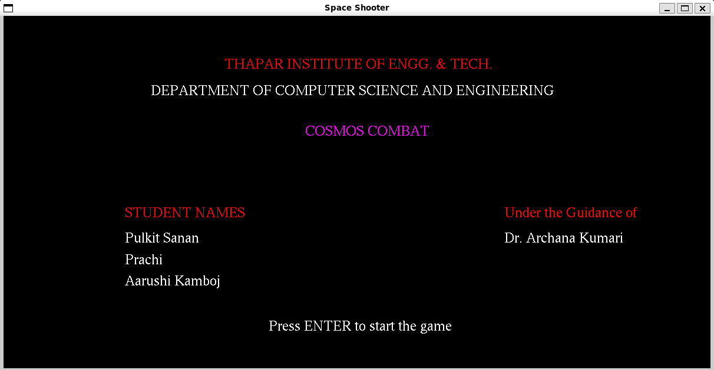
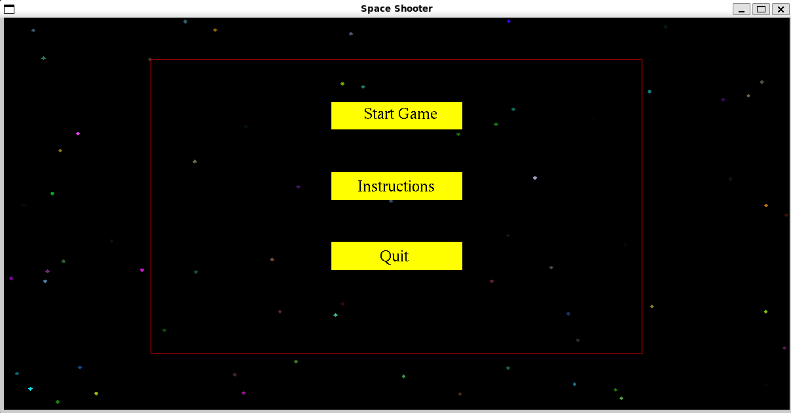
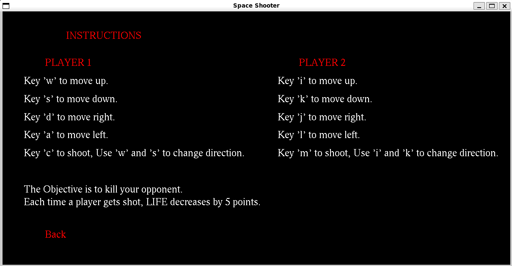
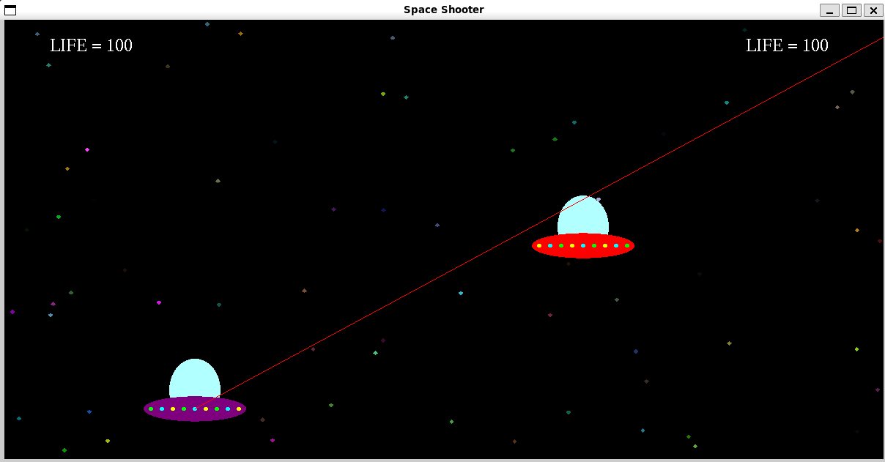
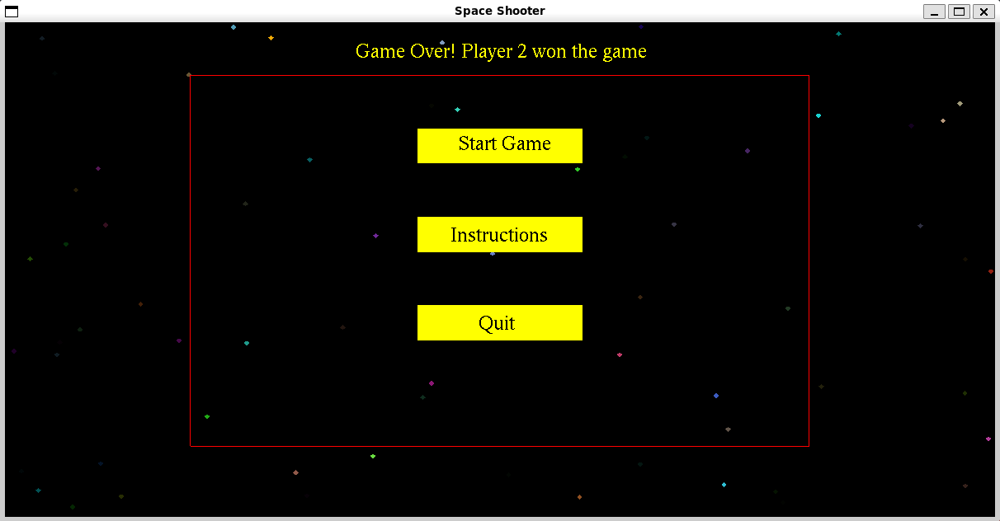

# Space Shooter Game

## Screenshots







## Table of Contents

1. [Introduction](#introduction)
2. [Project Setup](#project-setup)
3. [Gameplay Instructions](#gameplay-instructions)
4. [Computer Graphics Concepts Used](#computer-graphics-concepts-used)
5. [User Defined Functions](#user-defined-functions)
6. [Code Overview](#code-overview)

## Introduction

"Space Shooter" is a 2D game developed using OpenGL (Open Graphics Library) and GLUT (Graphics Library Utility Toolkit). In this game, players control spaceships and engage in combat within a simulated space environment. The objective is to reduce the opponent's life points to zero by shooting lasers at their spaceship.

## Project Setup

### Prerequisites

- OpenGL
- GLUT

### Compilation and Execution

1. Ensure you have the required libraries installed.
2. Compile the code using the following command:

   ```bash
   g++ -o space_shooter space_shooter.cpp -lGL -lGLU -lglut
   ```

3. Run the executable:

   ```bash
   ./space_shooter
   ```

## Gameplay Instructions

- Player 1 controls their spaceship using the following keys:
  - `w`: Move up
  - `s`: Move down
  - `d`: Move right
  - `a`: Move left
  - `c`: Shoot laser (use `w` and `s` to change direction)

- Player 2 controls their spaceship using the following keys:
  - `i`: Move up
  - `k`: Move down
  - `j`: Move right
  - `l`: Move left
  - `m`: Shoot laser (use `i` and `k` to change direction)

- The goal is to shoot the opponent's spaceship and reduce their life points to zero.

## Computer Graphics Concepts Used

- **OpenGL**: Cross-platform API for rendering 2D and 3D graphics.
- **GLUT**: Simplifies window creation, event handling, and input management.
- **Geometric Transformations**: Translation, rotation, scaling, and projection for positioning objects.
- **Primitive Drawing**: Drawing basic shapes such as points, lines, quads, and polygons.
- **Color and Shading**: Implementing shading techniques to simulate lighting and surface properties.
- **Text Rendering**: Displaying text on the screen using OpenGL's text rendering functions.
- **Event Handling**: Managing user interactions like keyboard inputs and mouse clicks.
- **2D Graphics Techniques**: Orthographic projection and 2D rendering for elements like health bars and menus.
- **Game Logic Integration**: Integrating graphics with game logic for spaceship movements, laser firing, and collision detection.
- **State Management**: Managing different game states (intro, menu, instructions, gameplay, game over).

## User Defined Functions

1. **displayRasterText**: Renders text on the screen using bitmap fonts.
2. **introScreen**: Displays the introduction screen.
3. **startScreenDisplay**: Displays the main menu screen and handles mouse input for starting the game.
4. **instructionsScreenDisplay**: Displays the instructions screen.
5. **DrawSpaceshipBody**: Renders the spaceship body and lights.
6. **DrawSpaceshipDoom**: Renders the glass dome of the spaceship.
7. **DrawLaser**: Renders a laser beam.
8. **SpaceshipCreate**: Creates a spaceship at specified coordinates.
9. **DisplayHealthBar1**: Renders the health bar for player 1.
10. **DisplayHealthBar2**: Renders the health bar for player 2.
11. **checkLaserContact**: Detects collisions between lasers and spaceships.
12. **gameScreenDisplay**: Manages rendering during gameplay.
13. **displayGameOverMessage**: Displays the game over message.

## Code Overview

- **Variables and Constants**: Define game settings, spaceship positions, and game states.
- **Main Functions**: Initialize the game, handle inputs, and manage game states.
- **Rendering Functions**: Draw spaceships, lasers, health bars, and handle collision detection.

---

**Thapar Institute of Engineering and Technology**  
**Computer Science and Engineering Department**  
Patiala – 147001
